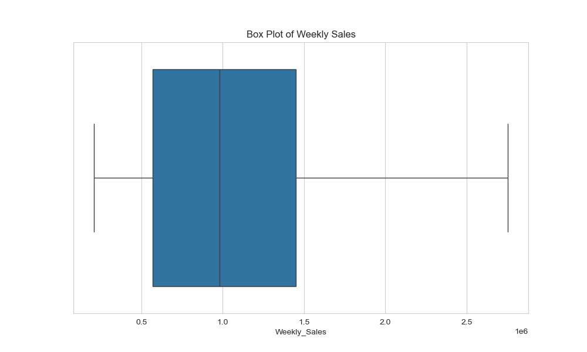

 # 🛒 Walmart Sales Forecasting using SARIMA

## 📌 Overview
This project applies **Time Series Analysis** to forecast **weekly sales** for Walmart stores using the **SARIMA (Seasonal AutoRegressive Integrated Moving Average)** model. The goal is to analyze **sales trends, seasonality, and patterns** to support business decision-making.

## 📈 Model Used
### **SARIMA (Seasonal ARIMA)**
- 📌 Captures **trend and seasonality** in time series data.
- 📌 Forecasts **next 12 weeks** of Walmart store sales.

---

## 📊 Visualizations & Insights

### **1️⃣ Sales Data Distribution**
- The box plot shows the **spread and distribution** of Walmart weekly sales data.
- Helps detect **outliers** and variations across different stores.
  
  

### **2️⃣ Weekly Sales Trends**
- The **seasonal trend** of weekly sales is visualized using a line plot.
- Clear **recurring patterns** suggest the presence of **seasonality** in the data.

  

### **3️⃣ Impact of Economic Factors**
- The following scatter plots show how **weekly sales are affected by external factors** like:
  - 🔥 **Temperature vs Sales**
  - 📉 **Unemployment vs Sales**
  - 🏷 **Consumer Price Index (CPI) vs Sales**
  
    
    
    

### **4️⃣ Top Performing & Lowest Performing Stores**
- The **Top 5 performing stores** based on total sales.
- Extracted **highest and lowest weekly sales values**.

    
    

### **5️⃣ Forecasted Sales for the Next 12 Weeks**
- Using the SARIMA model, we forecasted the next **12 weeks of sales**.
- The confidence intervals widen over time, indicating **higher uncertainty** in long-term predictions.

    

---

## 🏗 Steps Followed
1. **Data Preprocessing**: Cleaning and preparing the dataset.
2. **Exploratory Data Analysis (EDA)**: Understanding sales trends and patterns.
3. **Feature Engineering**: Extracting useful information from raw data.
4. **Time Series Modeling**: Applying **SARIMA** for forecasting.
5. **Evaluation & Insights**: Analyzing predictions and model performance.

---

## 🚀 Technologies Used
- **Python**
- **Pandas, NumPy** – Data handling & manipulation
- **Matplotlib, Seaborn** – Data Visualization
- **Statsmodels** – Time Series Analysis
- **GitHub** – Version Control

---

## 📌 How to Use
1. Clone the repository:  
   ```bash
   git clone https://github.com/kanna-vamshi-krishna/walmart-sales-forecast.git


